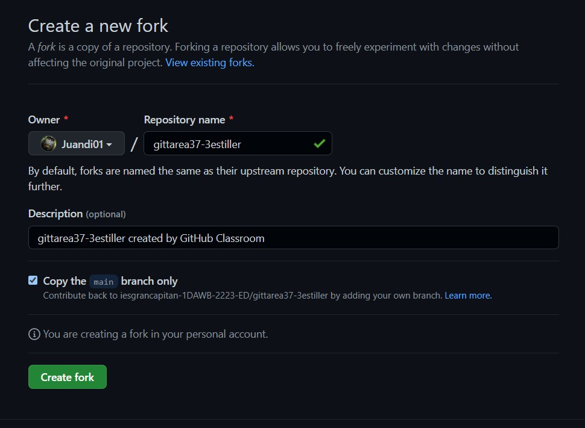
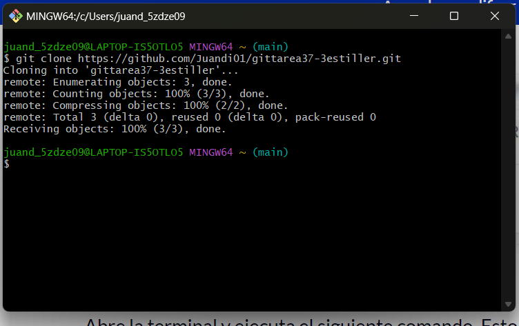
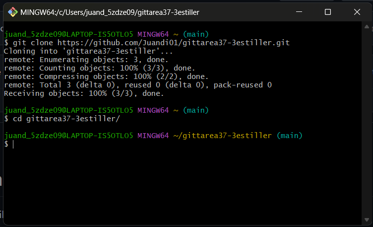
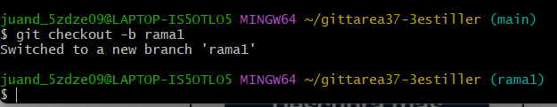
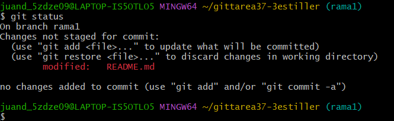
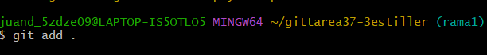
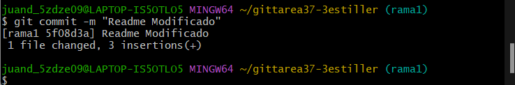
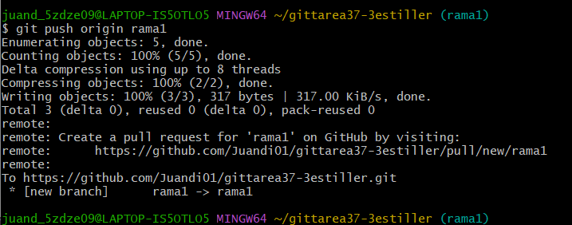
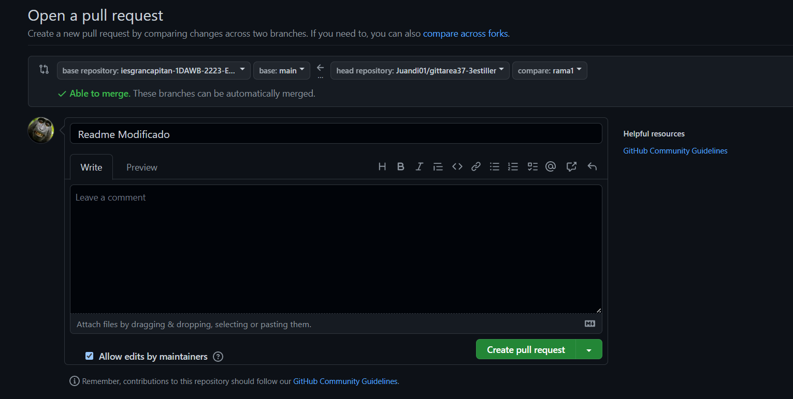
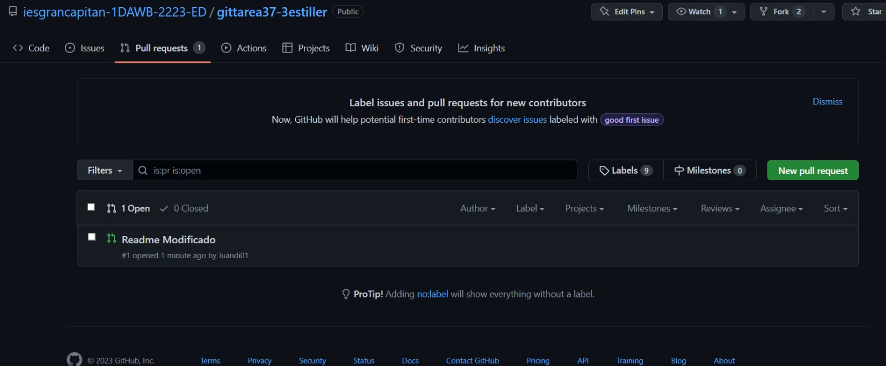

1. Realicemos un fork del repositorio
   Realiza un fork del repositorio haciendo un clic en el botón fork de la parte superior de la página. Esto creará una instancia del repositorio completo en tu cuenta.
   

2. Clona el repositorio
   Una vez que el repositorio esté en tu cuenta, clónalo a tu computador para trabajarlo localmente.

Para clonarlo, has clic en el botón "Code" y copia el link.

Abre la terminal y ejecuta el siguiente comando. Esto clonará el repositorio localmente.

Ahora hemos configurado una copia de la rama maestra desde el repositorio principal del proyecto en línea.
Debemos ir al repositorio clonado ejecutando el siguiente comando:

 3. Crea una rama
Es una buena práctica crear una rama (branch) nueva cuando trabajas con repositorios, ya sea que se trate de un proyecto pequeño o estés contribuyendo en un equipo de trabajo.

El nombre de la rama debe ser breve y debe reflejar el trabajo que estamos haciendo.

Ahora crea una rama usando el comando git checkout:

4. Realiza cambios y confírmalos
   Has cambios esenciales al proyecto y guárdalos.

Luego ejecuta git status , y verás los cambios.

status
Agrega esos cambios a la rama recién creada usando el comando git add:

Ahora confirma esos cambios utilizando el comando git commit:

 5. Envía los cambios a GitHub
Para enviar los cambios a GitHub, debemos identificar el nombre del repositorio remoto.

Para este repositorio el nombre es "origin".

Luego de identificar el nombre podemos enviar en forma segura los cambios a GitHub.

git push origin [Nombre de la Rama]

6. Crea un pull request
   Ve a tu repositorio en GitHub y verás un botón llamado "Pull request", has clic en él.
   

Por favor, provee todos los detalles necesarios de lo que has hecho (puedes referenciar problemas utilizando "#"). Ahora, envía el pull request.

¡Felicitaciones! Has hecho tu primer pull request.

Si tu pull request es aceptado recibirás un mail.
